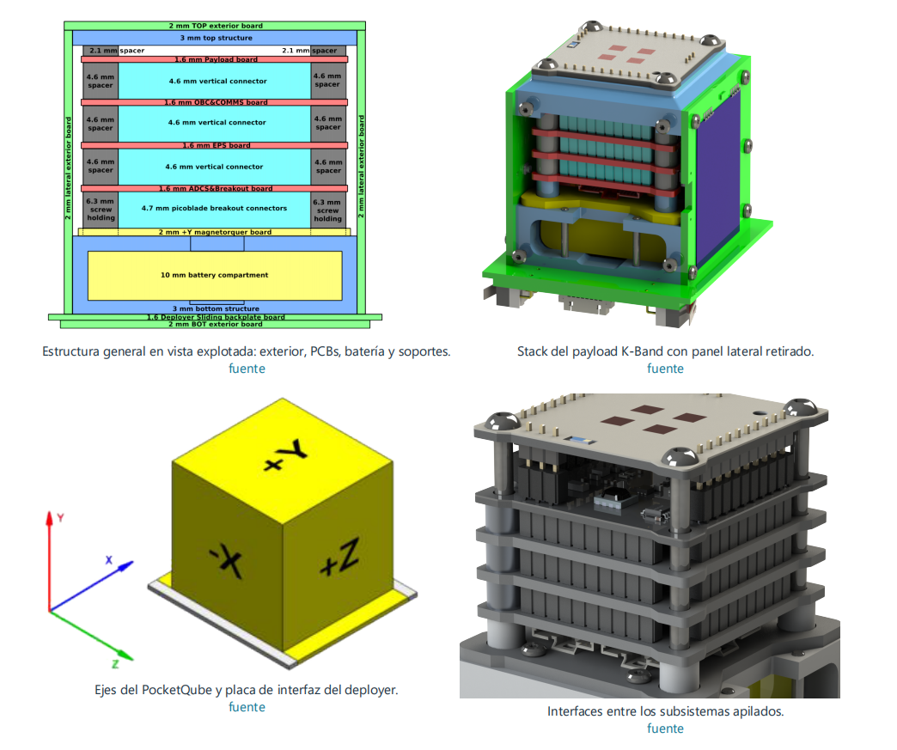
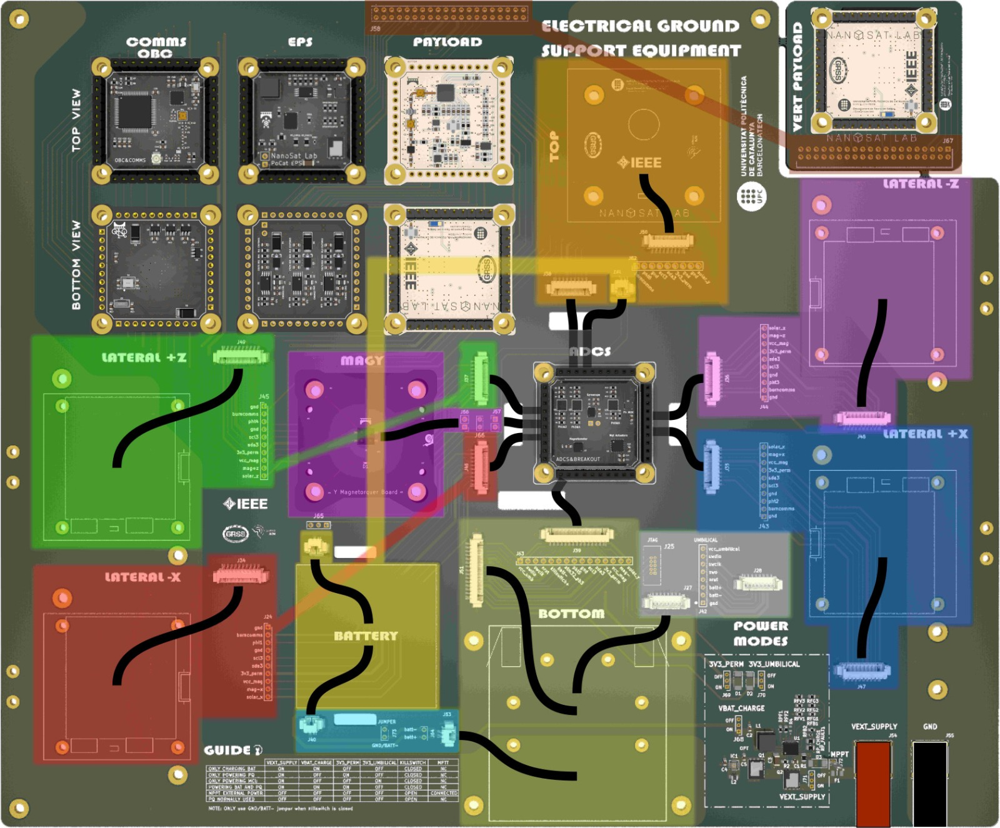
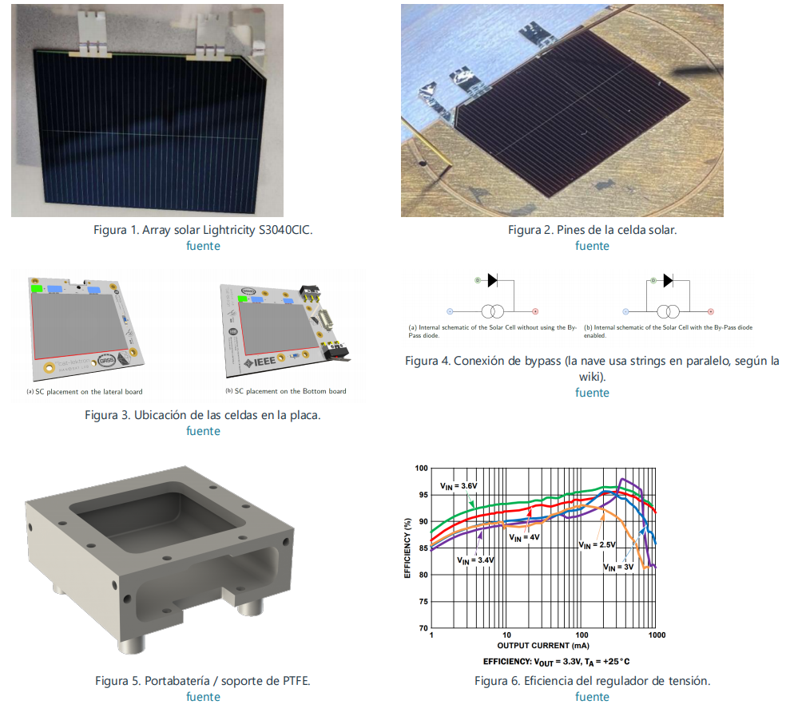

# IEEE Open PocketQube Kit – Hardware necesario

Este documento resume las placas, elementos estructurales,
componentes externos, cableado y tornillería necesarios para
el armado de la plataforma PocketQube.

> Nota:
> No se incluyen aquí payloads específicos de las variantes
> demostradoras de la Wiki. La carga útil se considera un
> subsistema independiente/custom.
>
> Las cantidades se basan principalmente en la documentación
> de montaje y hardware del IEEE Open PocketQube Kit.
> Algunas revisiones del repositorio y de la Wiki presentan
> pequeñas diferencias, por lo que siempre debe comprobarse
> la revisión final de PCB antes de comprar componentes.

Link de la wiki donde se explica todo sobre el proyecto:
 
>https://wiki.nanosatlab.space/shelves/ieee-open-pocketqube-kit-mFR

# 1. PLACAS PCB

## 1.1 Placas del PocketQube

| **Cantidad** | **Placa** | **Función** |
|---:|---|---|
| 1 | **PQ_ADCS_HBridge** | Control de actitud: recibe sensores y maneja los magnetorquers mediante puentes H. |
| 1 | **PQ_EPS** | Sistema de potencia: recibe energía solar, carga la batería y distribuye las tensiones del satélite. |
| 1 | **pq_obc_comms** | Computadora principal + comunicaciones por radio con tierra. |
| 1 | **pq_topboard** | Cara superior estructural e interfaz de la zona del payload. |
| 1 | **pq_botboard** | Cara inferior; integra celda solar, sensores y un magnetorquer eje -Y PCB. |
| 4 | **pq_latboard** | Caras laterales +X, -X, +Z y -Z. Integran celda solar, sensores y magnetorquer; una lleva además la antena COMMS. |
| 1 | **PQ_MagYBoard** | Magnetorquer interno dedicado al eje +Y. |
| 1 | **pq_botnotsobot** | Placa mecánica asociada al sliding/deployer y al sistema de despliegue. |
| **11** | **Total PCBs del conjunto** | Sin contar payload custom ni EGSE. |

### Magnetorquers

El PocketQube utiliza **6 magnetorquers**:

- 4 integrados en las `pq_latboard`
- 1 integrado en la `pq_botboard`
- 1 en la `PQ_MagYBoard`

Los magnetorquers integrados en las placas se forman mediante
pistas/bobinas de cobre del propio PCB, por lo que no se compran
como componentes independientes.

## 1.2 Placa de soporte en tierra

## Cableado e interconexiones

## Cableado e interconexiones

| ID | From | Num. of cables | Connector | To | Num. of cables | Connector | Length (mm) |
|---:|---|---:|---|---|---:|---|---:|
| 1 | Lat +Z | 10 | PicoBlade | PCB Connector | 10 | PicoBlade | |
| 2 | PCB Connector | 10 | PicoBlade | ADCS | 10 | PicoClasp | |
| 3 | Lat -Z | 10 | PicoBlade | PCB Connector | 10 | PicoBlade | |
| 4 | PCB Connector | 10 | PicoBlade | ADCS | 10 | PicoClasp | |
| 5 | Lat +X | 10 | PicoBlade | PCB Connector | 10 | PicoBlade | |
| 6 | PCB Connector | 10 | PicoBlade | ADCS | 10 | PicoClasp | |
| 7 | Lat -X | 10 | PicoBlade | PCB Connector | 10 | PicoBlade | |
| 8 | PCB Connector | 10 | PicoBlade | ADCS | 10 | PicoClasp | |
| 9 | Battery | 2 | PicoBlade | - | - | - | |
| 10 | PCB Connector | 2 | PicoBlade | Bottom Board | 2 | PicoBlade | |
| 11 | Battery Heater & NTC | 3 | PicoClasp | - | - | - | |
| 12 | PCB Connector | 3 | PicoClasp | ADCS | 3 | PicoClasp | |
| 13 | Umbilical | 8 | PicoBlade | PCB Connector | 8 | PicoBlade | |
| 14 | Bottom Board | 15 | PicoBlade | PCB Connector | 15 | PicoBlade | |
| 15 | PCB Connector | 15 | PicoBlade | ADCS | 15 | PicoClasp | |
| 16 | Top Board | 9 | PicoBlade | PCB Connector | 9 | PicoBlade | |
| 17 | PCB Connector | 9 | PicoBlade | ADCS | 9 | PicoClasp | |

La EGSE no forma parte del hardware de vuelo. Se utiliza en banco
para alimentación, mediciones, depuración e integración.

Por lo tanto:

- PCBs del PocketQube: 11
- PCB EGSE: 1
- Total a fabricar si se realiza todo el conjunto: 12

# 2. BATERÍA

| Cantidad | Elemento | Especificación |
|---:|---|---|
| 1 | Batería Li-ion | 3.7 V |
| 1 | Capacidad nominal | 1400 mAh |
| 1 | Energía nominal | 5.18 Wh |
| 1 | Modelo indicado en Assembly Wiki | 103540 |

La batería se instala dentro de la estructura inferior.

IMPORTANTE:
La documentación del proyecto posee revisiones que mencionan
otras baterías. Para este listado se conserva la especificación
indicada en la página de Assembly de la Wiki.

# 3. CELDAS SOLARES

Modelo indicado:

Lightricity S3040_CIC

Características aproximadas indicadas en la Wiki:

- Tecnología: Triple Junction GaAs
- Integración: CIC
- Dimensiones: 40.15 x 30.35 x 0.30 mm
- Área fotovoltaica activa: 12 cm²
- Tensión AM0: ~2.5 V
- Potencia AM0: ~0.5 W

## Cantidad

| Ubicación | Cantidad |
|---|---:|
| Lateral +X | 1 |
| Lateral -X | 1 |
| Lateral +Z | 1 |
| Lateral -Z | 1 |
| Bottom board | 1 |
| **TOTAL** | **5** |

La plataforma utiliza:

**5 x Lightricity S3040_CIC**

La cara superior/payload no lleva celda solar en esta
configuración de la Wiki.

# 4. FOTODIODOS

Modelo indicado:

**SLCD-61N8 – Advanced Photonix**

La arquitectura ADCS utiliza un fotodiodo en cada cara para
determinar la incidencia de radiación solar.

| Ubicación | Cantidad |
|---|---:|
| Cuatro lateral boards | 4 |
| Top board | 1 |
| Bottom board | 1 |
| **TOTAL** | **6** |

Cantidad a comprar:

**6 x SLCD-61N8**

Datos principales indicados en la documentación:

- Isc aproximada: 170 µA
- Voc aproximada: 0.4 V
- Máxima sensibilidad: 930 nm
- Acceptance Half Angle: 60°

# 5. SENSORES DE TEMPERATURA

Modelo:

**TCN75A / TCN75AVOA – Microchip**

La Wiki especifica un sensor de temperatura en cada placa
lateral.

Cantidad mínima documentada para las caras laterales:

**4 x TCN75A**

Características:

- Interfaz: I2C
- Rango: -40 °C a +125 °C
- Precisión: aproximadamente ±1 °C
- Bajo consumo

Verificar en la BOM final de `topboard` y `botboard` si la
revisión fabricada incorpora sensores de temperatura
adicionales.

# 6. KILLSWITCHES

El PocketQube utiliza:

**2 x killswitches**

Los dos interruptores están conectados en serie para proporcionar
redundancia.

Su función es mantener desconectada la batería mientras el
PocketQube se encuentra dentro del deployer.

Cuando el PocketQube es liberado:

1. los killswitches dejan de estar presionados;
2. se habilita la alimentación;
3. comienza la secuencia de encendido.

IMPORTANTE:
La Wiki de Assembly los describe asociados a la estructura/PCB
inferior. El repositorio también contiene `pq_botnotsobot`,
relacionado con la interfaz de despliegue. Confirmar la ubicación
mecánica exacta con la revisión final que se vaya a fabricar.

# 7. SISTEMA DE ANTENA COMMS

Se necesita una placa lateral configurada para comunicaciones.

Elementos principales:

| Cantidad | Elemento |
|---:|---|
| 1 | Antena desplegable de cinta metálica |
| 1 | Cable RF desde OBC-COMMS |
| 1 | Dyneema / UHMWPE |
| 1 | Resorte de extensión |
| 1 | Jumper SMT de guiado |
| 2 | Resistencias thermal-knife |
| 1 | Cable clip / sujeción de antena |
| 2 | Tornillos M2.5 asociados al mecanismo |
| según diseño | Inserts/elementos de fijación |

## Dyneema

Especificación indicada:

- UHMWPE
- diámetro: 0.35 mm
- resistencia aproximada: 26 kg

La documentación de mantenimiento utiliza aproximadamente
40 cm para realizar el montaje, dejando excedente para los
nudos.

## Resorte

Modelo indicado:

**McMaster-Carr 5108N98**

Su función es mantener tensión constante sobre el Dyneema.

## Jumper SMT

Modelo indicado:

**Harwin S1731-46R**

Se utiliza como guía y para mantener el Dyneema en contacto con
los thermal knives.

## Thermal knives

La revisión actual de la página del deployer utiliza:

**2 x resistencias de baja impedancia**

Valor actualmente indicado:

**4.7 ohm**

Estas resistencias son calentadas eléctricamente mediante
`BURNCOMMS`, cortando/fundiendo el Dyneema y permitiendo que la
antena se despliegue.

IMPORTANTE:
Documentación anterior de mantenimiento menciona 7.5 ohm.
Comprobar siempre el esquemático de la revisión fabricada antes
de comprar las resistencias.

# 8. CABLEADO INTERNO

## Laterales ↔ ADCS

Cantidad:

**4 x cables planos de 10 vías PicoClasp ↔ PicoBlade**

Uno para cada lateral:

- +X
- -X
- +Z
- -Z

Cada lateral debe conectarse al conector correspondiente del
ADCS para conservar correctamente la orientación de los ejes.

## Bottom structure ↔ ADCS

Cantidad:

**1 x cable plano de 15 vías**

Conecta la estructura/PCBs inferiores con el ADCS.

## Batería

Cantidad:

**1 x cable/conector PicoBlade para batería**

La batería se conecta desde la estructura inferior.

## NTC + heater de batería

Previsto:

**1 x cable plano de 3 vías**

Conecta:

- NTC de batería
- Battery heater
- ADCS

NOTA:
La propia Wiki indica que este sistema todavía no estaba
implementado en la versión del assembly documentada.

Debe considerarse:

**OPCIONAL / A VERIFICAR SEGÚN REVISIÓN**

## Cable RF

Cantidad:

**1 x cable RF/coaxial**

Ruta:

OBC-COMMS
↓
Lateral Board COMMS
↓
Antena

# 9. CONECTOR UMBILICAL

La Bottom Board incluye una interfaz umbilical.

Se utiliza para:

- carga de batería;
- alimentación externa;
- debugging;
- NRST;
- SWCLK;
- SWDIO;
- tensión de referencia/alimentación.

Debe contemplarse:

- conector umbilical en PCB;
- conector complementario;
- cable correspondiente para banco/EGSE.

# 10. ESTRUCTURA MECÁNICA

## Estructuras principales

| Cantidad | Elemento |
|---:|---|
| 1 | Top Structure |
| 1 | Bottom Structure |
| 1 | Sliding Plate |

### Top Structure

Espesor indicado en Assembly:

**3 mm**

### Bottom Structure

La Wiki la describe mediante una configuración estructural de:

**3 mm + 10 mm + 3 mm**

### Sliding Plate

Dimensiones de referencia del estándar 1P:

- ancho: 58.0 ± 0.1 mm
- largo: 64.0 ± 0.1 mm
- espesor de referencia: 1.6 mm

# 11. TORNILLERÍA

## Tornillos

| Cantidad | Tipo |
|---:|---|
| 4 | M2 x 6 ISO 14580 |
| 2 | M2 x 20 ISO 14580 |
| 20 | M2 x 5 ISO 14850 |

## Tornillos principales del stack

Se requieren además:

**4 x tornillos/standoffs M3**

La longitud debe definirse según la altura final del stack y
de la carga útil custom.

NO se fija aquí M3x30 o M3x35 porque esos valores corresponden
a configuraciones concretas de payload documentadas en la Wiki.

# 12. SPACERS

| Cantidad | Elemento |
|---:|---|
| 4 | M2 x 5 mm Nylon |
| 4 | M3 x 2 mm Aluminium |
| 12 | M3 x 4 mm Aluminium |
| 12 | M3 x 0.5 mm Aluminium |
| según necesidad | M3 x 0.1–0.5 mm Aluminium |

La Wiki indica agregar los spacers finos necesarios para obtener
aproximadamente:

**4.6 mm de separación entre PCBs**

# 13. HELICOILS / INSERTOS ROSCADOS

| Cantidad | Tipo |
|---:|---|
| 4 | HELICOIL PLUS FREE RUNNING M3 x 2D INOX |
| 16 | HELICOIL PLUS FREE RUNNING M2 x 1.5D INOX |
| 10 | HELICOIL PLUS FREE RUNNING M2 x 1D INOX |

Uso general:

- M3: tornillos principales/standoffs;
- M2 x 1.5D: fijación de laterales;
- M2 x 1D: Bottom Board / Bottom Structure.

# 14. ARANDELAS

Cantidad:

**12 x arandelas 3.2 x 6 x 0.5 mm INOX A2 DIN 433**

También cumplen función de ajuste fino de separación mecánica.

# 15. MAGNETORQUERS

La plataforma utiliza magnetorquers PCB.

No es necesario comprar bobinas externas para los siguientes:

- +X
- -X
- +Z
- -Z
- -Y

Estos están integrados en las placas exteriores mediante pistas
de cobre.

Para el eje restante se utiliza:

**1 x PQ_MagYBoard**

correspondiente al magnetorquer interno del eje +Y.

# 16. ELEMENTOS DE LA BATERÍA

Además de la batería se contempla:

| Cantidad | Elemento | Estado |
|---:|---|---|
| 1 | NTC de batería | previsto |
| 1 | Battery heater | previsto |
| 1 | Cable 3 vías | previsto |

La Wiki indica que el NTC/heater estaba previsto pero no
implementado todavía en el assembly documentado.

Por lo tanto debe verificarse antes de realizar la compra.

# 17. CONSUMIBLES DE MONTAJE

Conviene disponer de:

- Kapton tape
- Aluminum tape
- Soldadura
- Flux
- Material de limpieza de PCB
- Elementos de crimpado
- Terminales PicoBlade
- Terminales PicoClasp
- Cableado de repuesto
- Tornillos y spacers adicionales

# 18. TORQUES DE REFERENCIA

La Wiki proporciona como referencia:

| Tornillo | Torque |
|---|---:|
| M2 | 0.2 Nm |
| M2.5 | 0.5 Nm |
| M3 | 1 Nm |
| M4 | 2 Nm |

Para la tornillería específica del PocketQube deben respetarse
los valores y límites definidos para la estructura final.

# 19. RESUMEN DE ELEMENTOS PRINCIPALES A COMPRAR

## Hardware externo principal

| Cantidad | Elemento |
|---:|---|
| 1 | Batería Li-ion 3.7 V / 1400 mAh |
| 5 | Celdas solares Lightricity S3040_CIC |
| 6 | Fotodiodos SLCD-61N8 |
| 4 mínimo | Sensores TCN75A |
| 2 | Killswitches |
| 1 | Antena COMMS |
| 1 | Cable RF |
| 1 | Dyneema 0.35 mm |
| 1 | Resorte McMaster-Carr 5108N98 |
| 1 | Harwin S1731-46R |
| 2 | Resistencias thermal-knife |
| 4 | Cables 10 vías PicoClasp-PicoBlade |
| 1 | Cable 15 vías |
| 1 | Cable/conector de batería |
| 1 | Cable 3 vías NTC/heater (si se implementa) |
| 1 | Conjunto de conector umbilical |

# 20. RESUMEN GENERAL

Para construir la plataforma completa se debe contemplar:

### Fabricación PCB

- 11 PCBs correspondientes al PocketQube.
- 1 PCB EGSE para soporte en tierra.
- Payload custom tratado independientemente.

### Energía

- 1 batería.
- 5 celdas solares.
- Cableado de batería.
- Interfaz umbilical.

### ADCS

- 6 fotodiodos.
- 4 sensores de temperatura laterales como mínimo.
- Magnetorquers integrados en las PCBs.
- 1 Magnetorquer PCB +Y.

### Seguridad / despliegue

- 2 killswitches.
- Antena desplegable.
- Dyneema.
- 2 thermal knives.
- Resorte.
- Jumper SMT.
- Sistema mecánico de sujeción.

### Interconexión

- 4 cables laterales de 10 vías.
- 1 cable inferior de 15 vías.
- 1 cable de batería.
- 1 cable RF.
- 1 cable NTC/heater si se implementa.

### Mecánica

- Top Structure.
- Bottom Structure.
- Sliding Plate.
- Tornillería M2/M3.
- Spacers.
- Helicoils.
- Arandelas.
- Kapton y materiales auxiliares.
